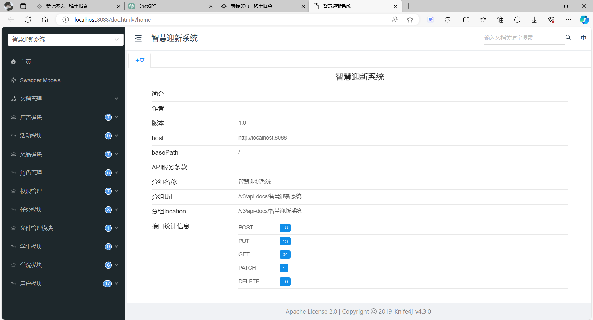
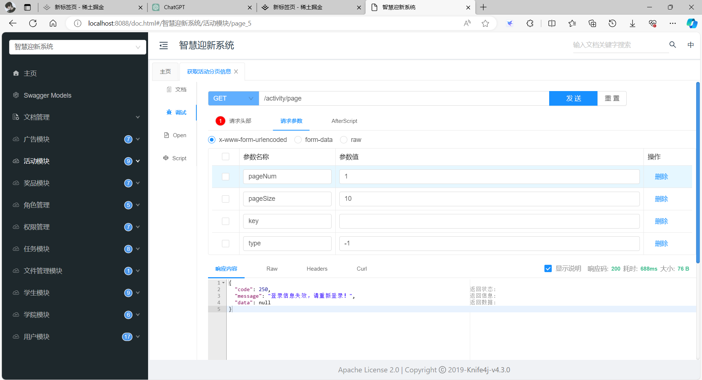
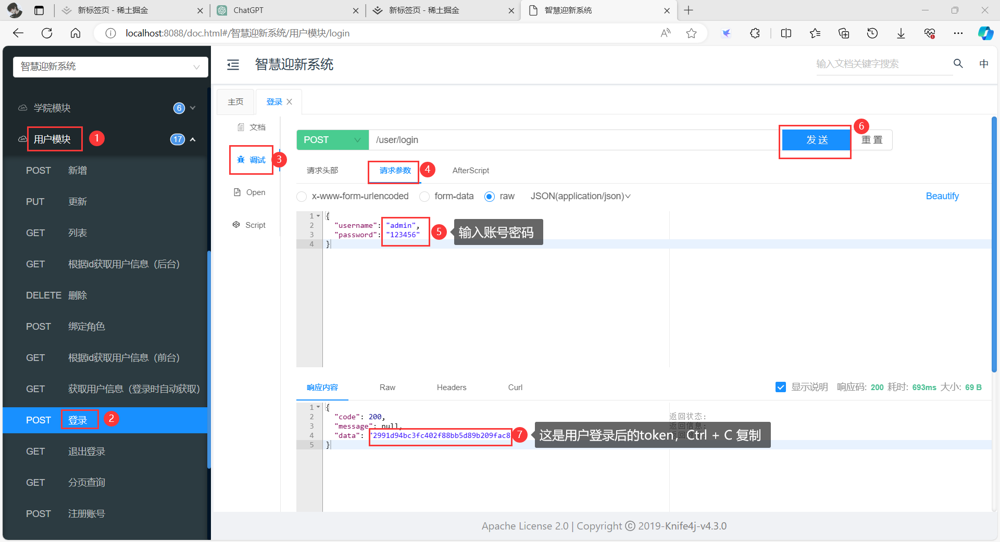
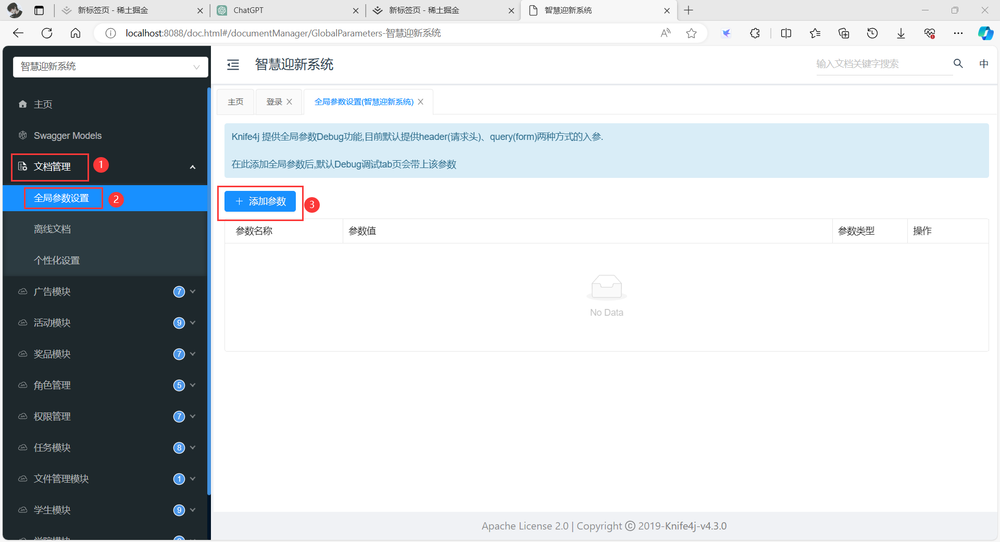
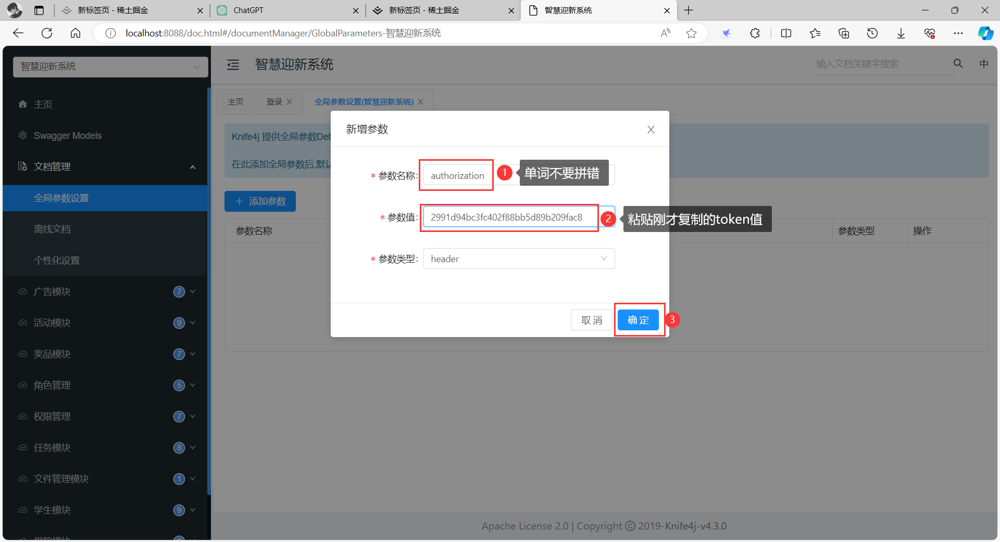
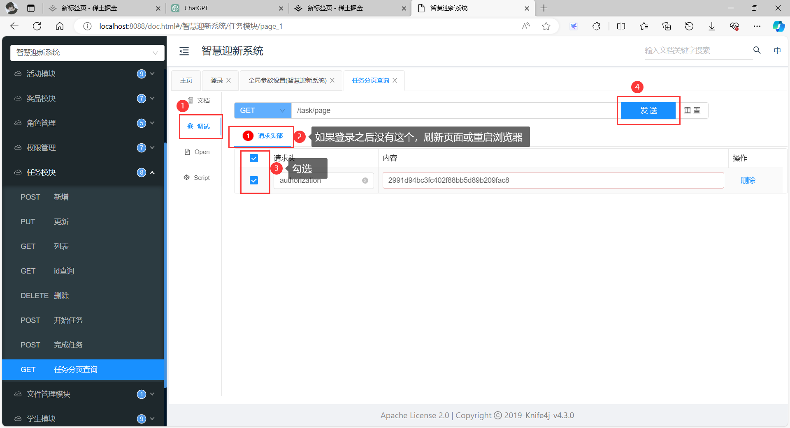
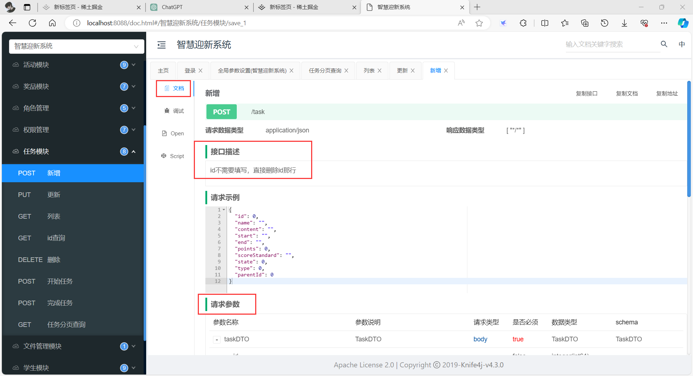
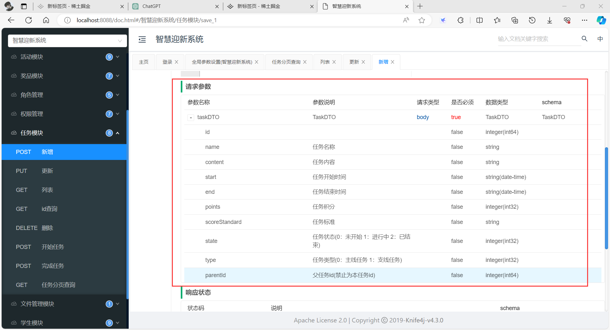

# 智能迎新系统
## 项目介绍

## 项目技术
本项目采用SpringBoot框架，数据库使用MySQL，缓存使用Redis。 
JDK版本：JDK 17  
SpringBoot版本：3.1.7  
MySQL版本：8.0.34  
Redis版本：6.2.6  
项目文档地址：http://localhost:8391/doc.html  
 
超级管理员账号：root 
超级管理员密码：123456 
首先修改 application.yml 中的配置文件(主要修改的地方有邮箱账号和密码，以及OSS相关配置，带有$$的部分) 
QQ邮箱STMP开启教学：https://zhuanlan.zhihu.com/p/643897161  
阿里云OSS帮助文档：https://help.aliyun.com/zh/oss/  
项目启动时一定确保MySQL(将resource包下的sql文件导入)与Redis已经连接(本地或是虚拟机，如果是虚拟机或服务器，需要将 application.yml 配置文件中的host端口号改成虚拟机或服务器的ip地址)，否则将无法正常实现登录功能  
---
本项目加入了鉴权功能，所以大部分接口需要用户登录验证，前端开发或后端测试端口时，需要在项目文档管理中设置传入用户token，否则会报下面的错误(出现以下报错均为未登录)：

> 步骤一：首先登录账号，获取token(用户模块中有登录功能)

> 步骤二：将拿到的token放入全局参数中
点击文档管理中的全局参数设置，选择添加参数，如图操作

此时才算登录成功，然后返回刚开始的查询分页接口，勾选token信息

这时数据就查询出来了，其他接口都一样。
---
如果哪里有问题，先看接口文档，常见的需求和问题会写在里面

其中也有相关请求参数的描述

注意：没有传值的参数一定要将那一行删除，不能留着，删除即传值NULL，不删除则为传值空字符串